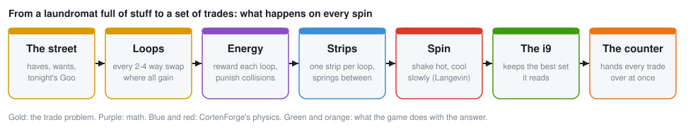
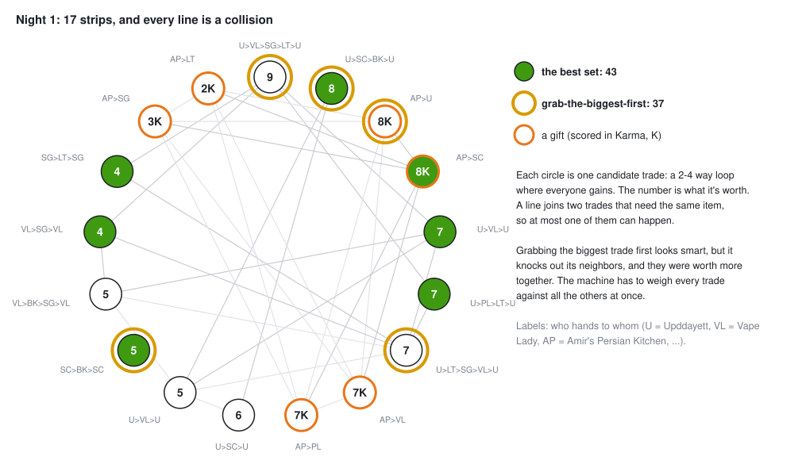
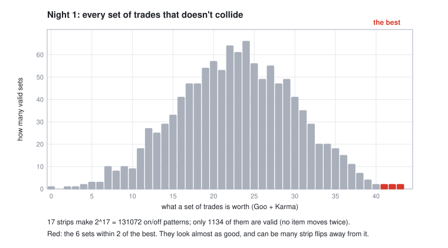
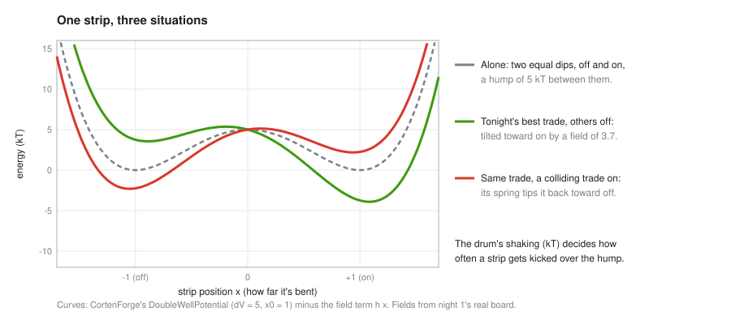
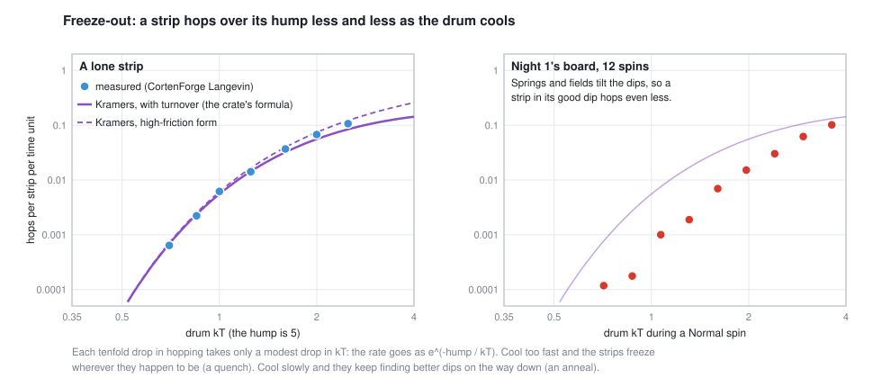
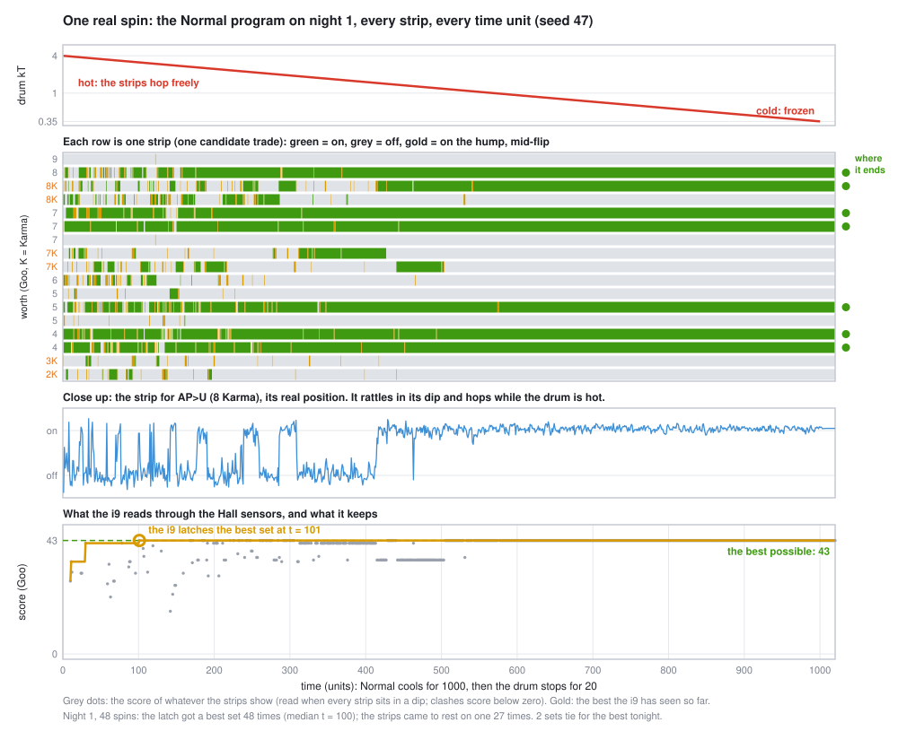
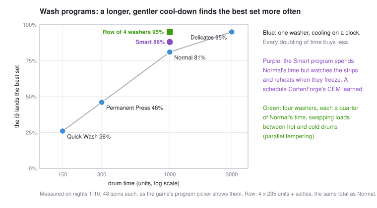

# How the machine works

The big washer at the back of Upddayett's laundromat isn't washing
anything. It's a computer. Every night it works out who on Market St
should swap what with whom, so that everybody goes home better off, and it
does that with physics: a drum full of springy steel strips, shaken hot
and cooled slowly, until the strips settle into the answer.

This page explains how, from the puzzle to the physics. **Every figure is
real data.** The curves are CortenForge simulations and the boards are the
game's real nights. They're drawn by
`cargo run --release --example machine_figs` (section 9), so you can
regenerate any of them yourself.



---

## 1. The puzzle

### Goo, and why trades go in loops

Nobody on Market St has money. What they have is stuff, and stuff is worth
different amounts to different people. The game measures that in **Goo**:
what a thing is worth *to one person, tonight* (1 Goo is about a can of
Mtn Goo to them). A bag of aeroponic kale might be worth 2 Goo to
Upddayett and 7 to Zestina. That gap is where every trade comes
from: the same thing is worth more in somebody else's hands.

A **trade** only happens if everyone in it comes out ahead. Two-way swaps
are rare, because it has to happen that you want what I have *and* I want
what you have. Economists call this the "double coincidence of wants".
It's the reason money was invented. The machine gets around it with
**loops**: A hands something to B, B to C, C back to A, each getting
something worth more to them than what they gave. Loops go up to 4
people. Every extra person is one more way the loop can fall apart (one
person doesn't show, and everyone else in it is stuck). That's why the
counter (section 7) holds everything until the drum stops.

This isn't made up for a game. **Kidney exchange** programs work the same
way: a patient whose donor doesn't match swaps donors with another pair,
in 2- and 3-way loops, all surgeries at once so nobody can back out. Alvin
Roth shared the 2012 economics Nobel partly for designing them.

### Tonight's board

Each evening the machine lists every loop where everyone gains. Each loop
is a **candidate trade**, and each candidate gets one **strip** in the
drum. The board also holds **gifts**: someone giving something away
(Amir's Persian Kitchen with its day-old food, or Upddayett if you tell him
to), scored in **Karma** rather than Goo. Karma counts a need met (food for
someone hungry, warmth on a cold night) at 1x, and a treat or a tool at
1.5x once that person's needs are covered.

Here is night 1, the night all the figures on this page use. It has 17
strips: 11 trades and 6 gifts.



Every line is a **collision**: two trades that need the same item. There's
only one cracked Android phone, so at most one trade that moves it can
happen. The job is to pick the set of trades that don't collide and add up
to the most.

The obvious way, grabbing the biggest trade first and then the biggest one
that still fits, gets **37**. The best set gets **43**, because the biggest
trade (worth 9) knocks out neighbors that were worth more together.
To get it right, every trade has to be weighed against all the others at
once.

### Why it's hard

Mathematicians call this the **maximum-weight independent set** problem,
and in general it's NP-hard: there's no known shortcut that stays fast as
it grows. Each strip is on or off, so 17 strips make 2^17 = 131,072
patterns. Only 1,134 of them are valid (nothing moves twice). Most are
middling, and the very top is thin and nearly tied:



On night 1, **two different sets tie for the best (43)**, and six sets are
within 2 of it. Those near-ties are the trap. A set worth 41 can look
almost as good and still be many strip flips away from the 43, with worse
sets in between. Anything that searches by small improvements gets stuck
there.

> **Honest aside.** At 17 strips an ordinary computer can check all 1,134
> valid sets in a blink, and the game does exactly that, to know "the best
> possible" and score the machine against it. The board is capped at 20
> strips for that reason. The machine isn't in the game because it beats a
> laptop at 17 strips. It's there because it's how a whole family of real
> hardware works (section 8), and because you can watch it think.

---

## 2. Turning the puzzle into energy

Here's the trick. Give any on/off pattern a **score**: add up what every
"on" trade is worth, and subtract a big penalty for every pair of colliding
trades that are both on. The penalty is bigger than any single trade, so a
collision never pays. The best set has the highest score.

Now flip the sign and call it **energy**. The best set becomes the
*lowest-energy* pattern. Nature is very good at finding low energy: water
runs downhill, and a hot metal cooled slowly settles into a tidy crystal.
So if we can build something whose energy *is* this score, physics will do
the searching for us.

This recipe (rewards on the bits, penalties on pairs of bits) is called a
**QUBO**, and it maps one-to-one onto an **Ising model**: a lattice of
little magnets that each point up or down and push or pull on their
neighbors. A huge range of hard problems can be written this way (Lucas,
"Ising formulations of many NP problems", 2014). Section 10 has the exact
formulas.

---

## 3. The strips

Each strip is a thin strip of spring steel, clamped at both ends and
buckled, like the lid of a snap-top jar. It has two stable shapes: bent
down (**off**) or bent up (**on**). Getting from one to the other means
pushing it over a hump. In the game they're called slap bits, and the
board cam (bottom left of the screen) shows them live.



Three forces act on each strip:

1. **The double well:** the two dips and the hump between them (5 kT
   tall). This is CortenForge's `DoubleWellPotential`.
2. **A tilt** toward on, as strong as the trade is valuable. This is an
   `ExternalField`, set from the trade's Goo or Karma.
3. **Springs** between strips whose trades collide. These are
   `PairwiseCoupling`s. When one strip goes on, its springs tip each
   colliding neighbor back toward off. The red curve shows tonight's best
   trade with a colliding trade switched on: its "on" dip is now the
   shallow one.

Then the drum shakes them. CortenForge's `LangevinThermostat` gives every
strip random kicks plus friction, balanced so the strips jiggle exactly as
much as real objects at temperature kT would. That balance is the
fluctuation-dissipation theorem, and it's the one physics promise the
thermostat makes. Turn the drum up and the kicks get stronger. Turn it
down and they fade. A Hall-effect sensor under each strip reads which
dip it's in.

All of it is a real CortenForge model, built like this (from
`src/trade/machine.rs`):

```rust
let xml = generate_mjcf(n, 1, dt, (0.0, 10.0));      // n strips, one control: the drum
let mut model = load_model(&xml)?;
let mut b = PassiveStack::builder();
for i in 0..n {
    b = b.with(DoubleWellPotential::new(delta_v, 1.0, i)); // the two dips
}
b = b.with(PairwiseCoupling::new(j, edges));               // springs between colliding trades
b = b.with(ExternalField::new(h));                         // each trade's tilt toward on
b = b.with(LangevinThermostat::new(gammas, k_b_t, seed, 0)
    .with_ctrl_temperature(0));                            // the drum: kT follows ctrl[0]
b.build().install(&mut model);
```

---

## 4. The spin: shake hot, cool slowly

If you shake the drum hard, the strips hop over their humps all the time,
trying everything. If you shake it gently, they mostly stay where they
are. The trick is to start hot and cool down slowly. While it's hot the
board explores freely. As it cools, hopping out of a good arrangement gets
rarer than hopping into one, until the strips freeze into a set that
doesn't collide and makes a lot of Goo.

That's **annealing**. Blacksmiths do it to steel (this whole project is
named after a steel, Corten), and computers have done it in software since
1983 (Kirkpatrick, Gelatt and Vecchi, "Optimization by Simulated
Annealing"). The drum does it in physics.

How fast does a strip hop? Hendrik Kramers worked it out in 1940: the rate
falls off like e^(-hump / kT). Each tenfold drop in hopping takes only a
modest drop in temperature. CortenForge ships Kramers' formula, so we can
check the simulation against it:



On the left, the blue dots are lone strips (no springs, no tilt) measured
in CortenForge. The purple lines are the crate's own Kramers formulas. In
the range where Kramers' theory applies (the hump several kT tall, drum at
1.25 or below) they agree within about 12%. When the drum is hot, the hump
is barely two kT and the formula drifts, as it should. On the right is the
real board during real spins. The tilts and springs deepen each strip's
favorite dip, so the board hops less than lone strips at the same
temperature, and it freezes solid below about kT 0.6.

Now watch a whole spin. This is one real Normal cycle on night 1, every
strip, every time unit:



Read it top to bottom:

- **The drum** (red) cools geometrically from 4 kT to 0.35 kT over 1,000
  time units, then stops for 20 so every strip drops into a dip.
- **The strips:**
  - For the first ~300 units they flicker: on, off, mid-hop (gold).
  - Between 300 and 500 they commit, one by one.
  - After ~500 nothing moves. The board is frozen, and the green rows are
    tonight's trades.
- **The close-up** is one strip's actual position. It rattles inside its
  dip the whole time (that's the heat), hops between dips while the drum
  is hot, and settles for good at t ≈ 410.
- **The score** (bottom) is what the strips spell out whenever all of them
  sit in a dip. It climbs as the board cools.

If you cool too fast, the strips freeze wherever they happen to be: a
**quench**, which lands in a mediocre set. In the game that's Quick Wash
("You spun it too fast, Daddy"). Cooling slower helps, but only
logarithmically: three times longer buys a few points.

---

## 5. The i9 watches

Upddayett wired an old i9 to the Hall sensors. Once every time unit it
reads the board. Whenever every strip sits in a dip, it scores what it
sees, and it remembers the best set so far. That's the gold line in the
spin figure. This one latched the best set at t = 101, long before the
strips stopped moving.

The latch matters because the strips don't always *finish* on the best
set. On night 1, out of 48 Normal spins:

|  | Found a best set (43) |
|---|---|
| Where the strips came to rest | 27 of 48 |
| What the i9 latched along the way | **48 of 48** |

Near the end of a spin the board can freeze into one of those near-ties.
The i9 has usually seen something better on the way down. Real
probabilistic computers (p-bits) are read the same way: sample the bits
as they fluctuate, keep the best.

---

## 6. Wash programs: better ways to spin

The program picker is a choice of cooling schedules. Longer and gentler
finds the best set more often, but each doubling of time buys less:



Two programs beat the clock instead of just taking longer:

- **Smart (learned)**
  - It spends the same time as Normal but watches the board as it spins:
    how far through the cool-down it is, how many strips are mid-hop, and
    how long since the i9 last found something better.
  - When the strips have frozen and the latch stops improving, it reheats
    and cools again (the i9 keeps the best).
  - Nobody hand-wrote that schedule. CortenForge's CEM (sim-rl's
    cross-entropy method) learned it on 11 hard nights.
  - On fresh nights it never trained on, it lands the best set 95% of the
    time against Normal's 83%.
- **Row of 4 washers**
  - It splits Normal's electricity across four drums, each held at a
    different temperature.
  - Every so often, neighbors offer to swap loads. A load stuck in a bad
    set on a cold drum can ride up to a hot one, get shaken loose and come
    back down.
  - This is **parallel tempering** (replica exchange), a standard tool for
    rugged problems like this one.
  - On held-out nights it beats the smart wash, 96.8% to 93.1%.

You can also run the drum by hand: the SPIN CYCLE panel's manual dial sets
kT directly. Freeze it, melt it, and watch the strips.

---

## 7. Your hands on the machine

Everything you do in the game changes the board, and so the physics:

- **I WANT...** ("Upddayett wants the hub motor"):
  - Every strip that delivers that item gets an extra tilt toward on.
  - The tilt is sized so the wanted strip is pinned, as if someone held
    it down with a thumb. Past a tilt of about 7.7 (for a hump of 5) the
    "off" dip disappears entirely.
  - The rest of the board then settles around it. The panel tells you
    what the want costs everyone else, in Goo.
- **Give-aways:** a gift strip, scored in Karma. The drum decides *who*
  gets it, sending it where it does the most good.
- **Prints:** Upddayett designs a part in code and CortenForge checks it
  will print. It becomes a new item, which means new loops and new strips.
- **The counter (escrow):** while the drum spins, the counter holds every
  item. When it stops, it hands every trade over at once, or not at all,
  so nobody in a loop gets left holding nothing.
- **Yuck:**
  - Some nights some people are yucky: they need 2 extra Goo out of any
    trade before it's worth it to them.
  - Two yucky people cut night 1-30's average from 11.5 trades to 7.2, and
    the best set from 41.6 Goo to 31.1.
  - The board gets *easier* (fewer strips fighting), not harder. It just
    gets poorer.
  - The trades yuck killed show up as ghost strips.
- **The Salties:** saboteurs who mess with the physics.
  - **A magnet** under the counter is a stray field: an extra tilt the i9
    didn't install, which pushes strips the wrong way.
  - **A coil** does the same, but only while the drum shakes.
  - **A power cut** stops the drum early: a quench.
  - **Your defenses are physics too:**
    - The *idle check* stops the drum and reads every strip at rest. The
      force from its dip has to balance the springs and tilts the i9 put
      there, so anything left over is a field it didn't put there. A
      magnet shows up as a strip sitting slightly off its usual spot.
    - A *steel shield* blocks a magnet if it covers it.
    - *The battery* (Ranchelle's cells) keeps the drum running through a
      cut, but then those cells can't be traded tonight.

---

## 8. Is this real?

**The physics is real; the machine is made up.** Nobody builds trade
computers out of buckled steel strips, but here's what is real:

- **The simulation is faithful.** CortenForge integrates every strip's
  motion with the proper noise. The hop rates match Kramers' theory within
  about 12% where that theory applies (the freeze figure, left). That
  check was run for this page.
- **The method is real.** Simulated annealing, parallel tempering and
  learned schedules are everyday tools for hard optimization problems.
- **The hardware family is real.** Ising machines solve problems written
  exactly like this one, as bits with tilts and couplings, settling into
  low energy:
  - quantum annealers (D-Wave);
  - digital annealers (Fujitsu);
  - probabilistic-bit (p-bit) circuits;
  - a new wave of "thermodynamic computing" chips that use noise on
    purpose, like this drum does.
- **The economics is real.** Swap loops with all-or-nothing hand-offs are
  how kidney exchange works.

**The limits:**
- 20 strips at most, so the game can always check the machine's answer
  exactly.
- One spin takes about 0.4 s of CPU: 102,000 physics steps.
- Below 20 strips a brute-force check is faster. The machine is the
  interesting way to do it, and the way that scales.

---

## 9. Try it yourself

All of these run from the repo (always `--release`):

| Command | What it does |
|---|---|
| `cargo run --release` | The game. Pick a program, press Run, watch the board cam. F1 opens the picture book. |
| `cargo run --release --example machine_figs` | Redraws every figure on this page (`-- spin --night 7` for one figure on another night). |
| `cargo run --release --example trade_cli -- cycles` | Lists tonight's candidate trades. |
| `cargo run --release --example trade_cli -- run` | One spin, printed as it settles. |
| `cargo run --release --example trade_cli -- bench` | Many spins: how often each answer lands. |
| `cargo run --release --example trade_cli -- night --night 7` | A night's conditions. |
| `cargo run --release --example trade_cli -- versus --smart` | Normal vs the learned program, night by night. |
| `UPD_SCOPE=3 cargo run --release` | Opens the scope on strip 3: its position and the drum's kT, live. |

---

## 10. For the curious: the math

**The energy.** With x_i ∈ {0, 1} for strip i (1 = on), v_i the trade's
value scaled so the largest is 1.5, and P the collision penalty
(1.6 × 1.5 = 2.4):

```
E(x) = − Σ_i v_i x_i  +  P Σ_{i,k collide} x_i x_k
```

P > max v_i, so turning on a second colliding trade always costs more
than it earns. The ground state of E is the best valid set.

**To Ising.** With spins s = 2x − 1 (on = +1) and the crate's convention
H = −Σ J_ik s_i s_k − Σ h_i s_i, take H = β E + const with β = 5 (how many
kT one unit of score is worth):

```
J_ik = −β P / 4                          (colliding pairs push apart)
h_i  = β v_i / 2  −  Σ_k β P / 4         (the tilt, less the collision bookkeeping)
```

**The strip.** Each strip is a particle of mass 1 at position x_i:

```
m ẍ_i = −V′(x_i) + h_i + Σ_k J_ik x_k − γ ẋ_i + √(2 γ kT / dt) · z_i
V(x)  = ΔV (x² − 1)²
```

Here ΔV = 5 (the hump), γ = 1 (friction), z_i is unit Gaussian noise
drawn fresh each step, and dt = 0.01. The tilt can't exceed
8ΔV / (3√3) ≈ 7.7 without erasing the far dip; that's the want's thumb
clamp.

**The schedule.** Normal's kT runs 4 → 0.35 geometrically over 1,000
units, then 0 for 20. The i9 samples every unit. Hop rate (Kramers, with
the crate's turnover correction):

```
k ≈ (ω_a / 2π) · (λ_r / ω_b) · e^(−ΔV / kT) · Υ
```

**Where it lives in the code:**
- `src/trade/cycles.rs`: finding the loops.
- `src/trade/qubo.rs`: the energy and the Ising conversion.
- `src/trade/machine.rs`: the strips and the drum.
- `src/trade/mod.rs`: the spin and the i9 latch.
- `src/trade/smart.rs`: the learned program.
- `src/trade/row.rs`: the row of washers.
- `src/trade/salties.rs`: the sabotage.

The build history, with every measurement, is in `docs/PLAN.md`.
